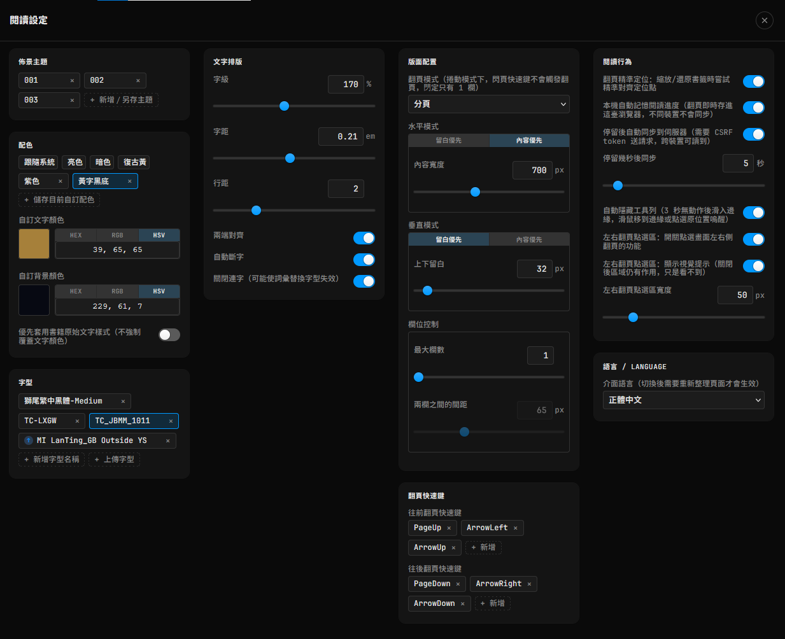
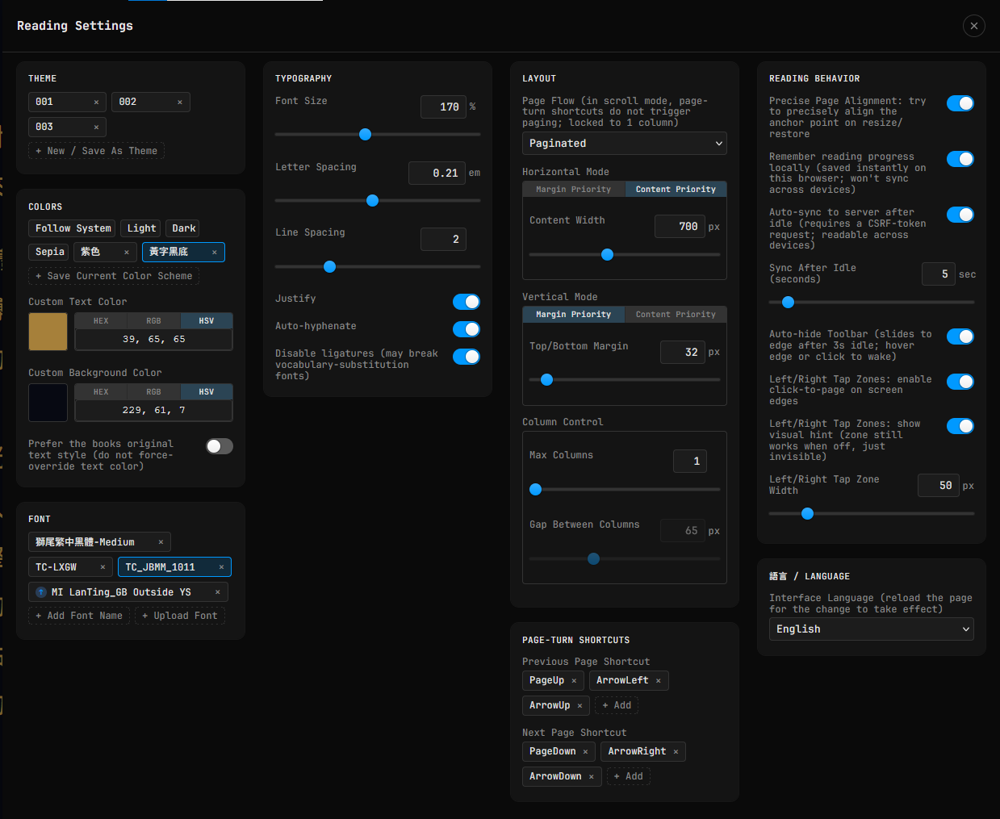

# calibre-web-foliate-mod

一支 Tampermonkey 使用者腳本，把 Calibre-Web 內建、基於 epub.js 的閱讀器，換成自己包裝的 [foliate-js](https://github.com/johnfactotum/foliate-js) 閱讀器。介面支援繁體中文／英文，依瀏覽器語言自動切換，設定裡也可以手動指定。

[English version below](#calibre-web-foliate-mod-1)

## 這是為了什麼寫的

Calibre-Web 內建的 epub.js 閱讀器，排版控制項有限（字級、字距、行距、留白這些細部排版選項都沒有或不夠精準），介面樣式也沒辦法自訂。這支腳本在不改動 Calibre-Web 伺服器端程式碼的前提下，用 Tampermonkey 在瀏覽器端把閱讀器整個換掉，改用排版控制更細緻、可以深度自訂外觀的 foliate-js，同時盡量保留 Calibre-Web 原本的書籤同步、閱讀進度這些既有機制，讓使用者原本習慣的操作方式（書籤、進度）維持不變，只是排版引擎跟介面換了。

## 有什麼特別的功能

- **細部排版控制**：字級（最大到 300%）、字距（最大到 0.5em）、行距（最大到 5）、左右對齊、斷字，都可以獨立調整並即時套用。
- **留白優先／內容優先**：水平、垂直方向各自獨立選擇——留白優先是設定固定的留白值；內容優先是設定固定的內容寬／高度，留白自動吸收可視範圍變動的差額，切換全螢幕/一般模式時內容區大小維持一致。
- **欄位控制**：分頁模式下最大欄數、兩欄之間的間距（捲動模式下強制鎖定為 1 欄，這兩項會自動停用）。
- **佈景主題**：內建跟隨系統、亮色、暗色、復古黃四種固定主題，也可以把目前的排版設定另存成自訂主題，多組主題可以拖曳排序、可以用目前設定覆蓋更新既有主題。
- **自訂配色**：文字顏色跟背景顏色可以分別用 HEX / RGB / HSV 三種格式輸入（也有一個自製的取色器可以用滑鼠選色），配色組合可以另存多組、拖曳排序。
- **字型管理**：可以手動輸入系統已安裝的字型名稱，也可以直接上傳字型檔案（.ttf / .otf / .woff）嵌入使用，字型名稱清單一樣支援拖曳排序。
- **左右翻頁點擊區**：畫面左右兩側可以設定點擊感應區，點擊觸發往前/往後翻頁；感應區的啟用（能不能點）跟顯示（看不看得到）是分開的兩個開關，感應區寬度可以自訂像素值；捲動模式下這個功能沒有意義，會自動停用。
- **自動隱藏工具列**：閱讀時工具列跟進度條可以在幾秒無動作後自動滑出畫面，滑鼠移到邊緣或點擊即可喚醒。
- **翻頁快速鍵**：往前/往後翻頁的鍵盤快速鍵可以自訂，每個方向可以錄製不只一組按鍵組合。
- **書籤與進度**：沿用 Calibre-Web 原本的伺服器端書籤機制；另外本機也會自動記住閱讀進度（每次翻頁即時記），可以設定閱讀停留超過一段時間後自動同步回伺服器書籤。
- **翻頁精準定位**（實驗性功能，預設關閉）：調整排版設定或縮放視窗時，盡量把目前閱讀到的那一行文字精準對齊到新版面的頁首，減少畫面跳動或閱讀位置跑掉的情況；捲動模式下沒有「頁首」這個概念，會自動停用。
- **雙語介面**：預設依瀏覽器判斷顯示繁體中文或英文，也可以在設定裡手動指定（切換後需要重新整理頁面才會生效）。

## 安裝需求

需要安裝 [Tampermonkey](https://www.tampermonkey.net/) 瀏覽器擴充功能（Chrome、Firefox、Edge 等主流瀏覽器皆可）。前往上面連結，依照頁面上針對你使用的瀏覽器提供的安裝步驟操作即可，一般穩定版本就可以正常運作。

## 使用方式

1. 安裝 Tampermonkey（見上）。
2. 安裝這支腳本：[calibre-web-foliate-mod.user.js](https://raw.githubusercontent.com/bgtsai/calibre-web-foliate-mod/main/calibre-web-foliate-mod.user.js)
3. 在 Calibre-Web 開啟任一本 EPUB，閱讀器會自動替換成 foliate-js 版本，右上角齒輪圖示可以開啟排版設定面板。

## 介面語言顯示不符預期？

介面預設依瀏覽器回報的「網頁內容偏好語言」自動判斷（開頭是 `zh` 就顯示繁體中文，其他一律顯示英文）。這組設定跟瀏覽器本身的**介面顯示語言**（選單、按鈕這些）是兩個各自獨立、可以不一樣的設定——瀏覽器介面是中文，不代表這組「網頁內容語言」也一定是中文。如果自動判斷的結果不是你要的，可以：

- 到設定面板最下方的「語言 / Language」分組，手動指定要顯示的語言（切換後需要重新整理頁面才會生效）；或
- 調整瀏覽器本身「網頁內容偏好語言」的設定（以 Firefox 為例：設定 → 一般 → 語言 → 選擇偏好語言以顯示網頁，把繁體中文排到清單最上面）。

---

# calibre-web-foliate-mod

A Tampermonkey userscript that replaces Calibre-Web's built-in, epub.js-based reader with a self-packaged [foliate-js](https://github.com/johnfactotum/foliate-js) reader. The interface supports Traditional Chinese and English, switching automatically based on your browser's language, with a manual override available in the settings.

## Why this exists

Calibre-Web's built-in epub.js reader has limited typography controls (font size, letter spacing, line spacing, and margins are either missing or imprecise), and its interface can't be customized. Without touching Calibre-Web's server-side code, this script uses Tampermonkey to swap out the reader entirely on the browser side, replacing it with foliate-js, which offers much finer typography control and deep visual customization — while keeping Calibre-Web's existing bookmark sync and reading-progress mechanisms intact, so your usual workflow (bookmarks, progress) stays the same; only the rendering engine and interface change.

## Features

- **Fine-grained typography**: font size (up to 300%), letter spacing (up to 0.5em), line spacing (up to 5), justification, and hyphenation — all independently adjustable and applied instantly.
- **Margin Priority / Content Priority**: independently selectable for the horizontal and vertical axes. Margin Priority sets a fixed margin value; Content Priority sets a fixed content width/height, with the margin automatically absorbing any change in available space — content size stays consistent when toggling fullscreen.
- **Column Control**: max columns and gap between columns in paginated mode (locked to 1 column in scroll mode; these two settings are automatically disabled there).
- **Themes**: four built-in themes (Follow System, Light, Dark, Sepia), plus the ability to save your current typography settings as a custom theme. Multiple themes can be reordered by drag-and-drop, and an existing theme can be overwritten with your current settings.
- **Custom colors**: text and background colors can each be entered in HEX / RGB / HSV format (a built-in color picker is also available), with color schemes savable, reorderable by drag-and-drop.
- **Font management**: manually enter the name of a font already installed on your system, or upload a font file (.ttf / .otf / .woff) directly; the font list also supports drag-and-drop reordering.
- **Left/right tap zones**: click zones on either edge of the screen for previous/next page navigation. Enabling the zone (click-to-page) and showing its visual hint are separate toggles; zone width is configurable in pixels. This feature is meaningless in scroll mode and is automatically disabled there.
- **Auto-hide toolbar**: the toolbar and progress bar can slide out of view after a few seconds of inactivity while reading, and wake up on hover or click.
- **Page-turn shortcuts**: customizable keyboard shortcuts for previous/next page, with multiple key combinations recordable per direction.
- **Bookmarks and progress**: uses Calibre-Web's existing server-side bookmark mechanism; reading progress is also remembered locally (saved instantly on every page turn), with an option to auto-sync back to the server bookmark after a configurable idle period.
- **Precise page alignment** (experimental, off by default): when adjusting typography settings or resizing the window, attempts to precisely align the currently-read line to the top of the new layout, reducing visual jumps or lost reading position. There's no "top of page" concept in scroll mode, so this is automatically disabled there.
- **Bilingual interface**: defaults to Traditional Chinese or English based on your browser, with a manual override available in settings (requires a page reload to take effect).

## Requirements

You'll need the [Tampermonkey](https://www.tampermonkey.net/) browser extension (works with Chrome, Firefox, Edge, and other major browsers). Visit the link above and follow the installation steps shown for your specific browser — the regular stable release works fine.

## Usage

1. Install Tampermonkey (see above).
2. Install this script: [calibre-web-foliate-mod.user.js](https://raw.githubusercontent.com/bgtsai/calibre-web-foliate-mod/main/calibre-web-foliate-mod.user.js)
3. Open any EPUB in Calibre-Web — the reader will automatically switch to the foliate-js version. Click the gear icon in the top-right corner to open the typography settings panel.

## Interface showing the wrong language?

By default, the interface language is auto-detected from your browser's reported "preferred content language" for web pages (starts with `zh` → Traditional Chinese; anything else → English). This is a separate setting from your browser's own **display language** (menus, buttons, etc.) — having a Chinese browser UI doesn't necessarily mean this "content language" setting is also Chinese. If the auto-detected result isn't what you want:

- Go to the "Language" group at the bottom of the settings panel and manually select your preferred language (requires a page reload to take effect); or
- Adjust your browser's "preferred content language" setting (in Firefox, for example: Settings → General → Language → Choose your preferred language for displaying pages, then move Chinese to the top of the list).
