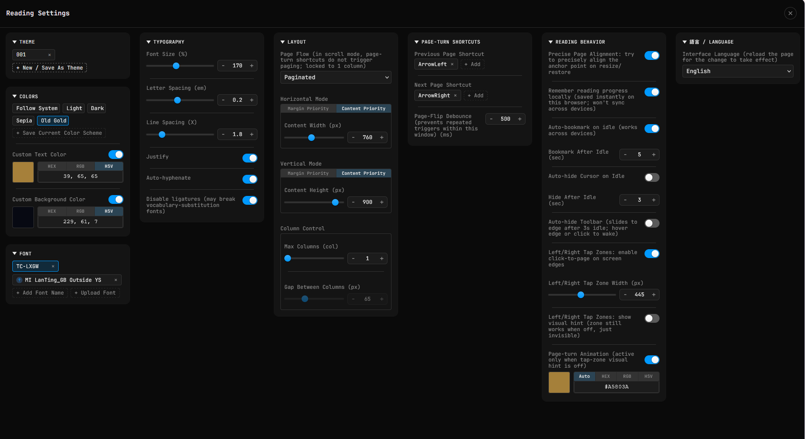

# calibre-web-foliate-mod

**English** | [繁體中文](README.zh.md)

A Tampermonkey userscript that replaces Calibre-Web's built-in, epub.js-based reader with a self-packaged [foliate-js](https://github.com/johnfactotum/foliate-js) reader. The interface supports Traditional Chinese and English, switching automatically based on your browser's language, with a manual override available in the settings.

## Why this exists

Calibre-Web's built-in epub.js reader has limited typography controls (font size, letter spacing, line spacing, and margins are either missing or imprecise), and its interface can't be customized. Without touching Calibre-Web's server-side code, this script uses Tampermonkey to swap out the reader entirely on the browser side, replacing it with foliate-js, which offers much finer typography control and deep visual customization — while keeping Calibre-Web's existing bookmark sync and reading-progress mechanisms intact, so your usual workflow (bookmarks, progress) stays the same; only the rendering engine and interface change.

## Features

### Typography

- **Font size**: adjustable from 50% to 300%.
- **Letter spacing**: adjustable from −0.1em to 0.5em.
- **Line spacing**: adjustable from 1× to 5×.
- **Justification**: toggle full justification on or off.
- **Auto-hyphenation**: toggle automatic hyphenation on or off.
- **Disable ligatures**: turn off OpenType ligature substitution. Useful when a font uses the ligature mechanism for advanced purposes such as glyph-level character mapping (common in fonts that implement display-layer script conversion, e.g. simplified-to-traditional Chinese). When letter spacing is applied, such fonts may show uneven spacing within certain word groups; enabling this option normalizes spacing at the cost of disabling those substitutions.

> [!NOTE]
> If you notice certain words or character groups appearing noticeably tighter than the surrounding text when using a custom letter spacing, try enabling **Disable Ligatures**. This is most commonly seen with fonts that perform glyph substitution for script conversion.

### Layout

- **Page flow**: switch between Paginated and Scroll mode.
- **Horizontal mode**: choose between Margin Priority (fixed margin) and Content Priority (fixed content width). In Content Priority mode, set the target content width in pixels; the margin absorbs any leftover space, keeping content width consistent when toggling fullscreen.
- **Vertical mode**: choose between Margin Priority (fixed margin) and Content Priority (fixed content height), with the same logic as horizontal mode.
- **Column control**: set the maximum number of columns and the gap between them in paginated mode. Both settings are automatically disabled in scroll mode (locked to 1 column).

### Themes and colors

- **Themes**: four built-in themes (Follow System, Light, Dark, Sepia), plus the ability to save your current settings as a named custom theme. Multiple themes can be reordered by drag-and-drop, and an existing theme can be overwritten with your current settings.
- **Custom colors**: text and background colors can each be entered in HEX / RGB / HSV format, with a built-in color picker also available. Color schemes are savable and reorderable by drag-and-drop.

### Fonts

- Manually enter the name of a font already installed on your system, or upload a font file (.ttf / .otf / .woff) to embed it directly. Font files are stored in the browser's IndexedDB and persist across sessions. The font list supports drag-and-drop reordering.

### Page-turn shortcuts

- Fully customizable keyboard shortcuts for previous/next page. Multiple key combinations can be recorded per direction.
- **Page-flip debounce**: set a minimum interval (in milliseconds) between consecutive page-turn triggers from the same shortcut, to prevent accidental double-flips.

### Reading behavior

- **Precise page alignment** (experimental, off by default): when adjusting typography settings or resizing the window, attempts to align the currently-read line to the top of the new layout, reducing visual jumps. Automatically disabled in scroll mode.
- **Local reading progress**: reading position is saved locally on every page turn. On reopening a book, the reader restores the last position automatically.
- **Auto-sync to server**: optionally sync the local reading position back to Calibre-Web's server-side bookmark after a configurable idle period. Can also be triggered manually.
- **Auto-hide cursor**: the cursor hides automatically after a configurable number of seconds of inactivity, and reappears on mouse movement.
- **Auto-hide toolbar**: the toolbar and progress bar slide out of view after a few seconds of inactivity and reappear on hover or click.
- **Left/right tap zones**: clickable zones on the left and right edges of the screen for previous/next page navigation. The zone can be enabled (click-to-page) independently of its visual hint (whether the zone boundary is visible). Zone width is configurable in pixels. Automatically disabled in scroll mode.
- **Page-turn animation**: a brief directional chevron animation plays at the tap zone position on each page turn, confirming the direction. Color is configurable (or follows the current theme automatically). Automatically disabled when the tap-zone visual hint is on.

### Interface

- **Language**: defaults to Traditional Chinese or English based on your browser's preferred language for web content. Can be manually set to either language; a page reload is required for the change to take effect.

## Requirements

You'll need the [Tampermonkey](https://www.tampermonkey.net/) browser extension (works with Chrome, Firefox, Edge, and other major browsers). Visit the link above and follow the installation steps shown for your specific browser — the regular stable release works fine.

## Usage

1. Install Tampermonkey (see above).
2. Install this script: [calibre-web-foliate-mod.user.js](https://cdn.jsdelivr.net/gh/bgtsai/calibre-web-foliate-mod@main/calibre-web-foliate-mod.user.js)
3. Open any EPUB in Calibre-Web — the reader will automatically switch to the foliate-js version. Click the gear icon in the top-right corner to open the settings panel.

## Interface language not as expected?

The interface defaults to Traditional Chinese or English based on your browser's reported "preferred language for web content" — if it starts with `zh`, Chinese is shown; otherwise English. This setting is independent of your browser's own UI language (menus, buttons, etc.) — a browser with a Chinese interface doesn't necessarily report Chinese as the preferred web content language. If the auto-detected result isn't what you want, you can:

- Go to the "語言 / Language" section at the bottom of the settings panel and manually set the display language (a page reload is required for the change to take effect); or
- Adjust your browser's "preferred language for web content" setting (in Firefox: Settings → General → Language → Choose your preferred language for displaying pages, and move Traditional Chinese to the top of the list).
