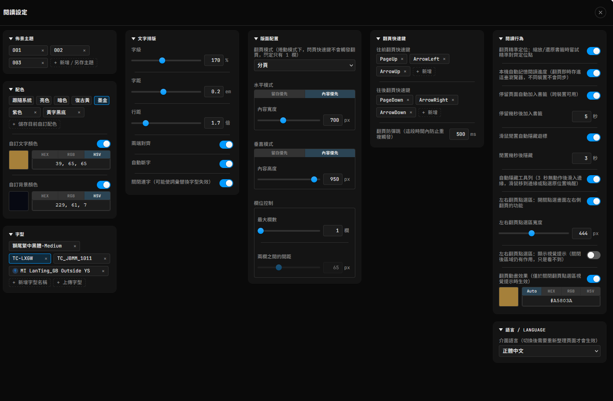

# calibre-web-foliate-mod

[English](README.md) | **繁體中文**

一支 Tampermonkey 使用者腳本，把 Calibre-Web 內建、基於 epub.js 的閱讀器，換成自己包裝的 [foliate-js](https://github.com/johnfactotum/foliate-js) 閱讀器。介面支援繁體中文／英文，依瀏覽器語言自動切換，設定裡也可以手動指定。

> 本腳本針對 [linuxserver/docker-calibre-web](https://github.com/linuxserver/docker-calibre-web) 開發與測試。不想安裝腳本或瀏覽器無法安裝 Tampermonkey（例如 iOS）時，請改用 [Docker 鏡像版](#不想裝腳本或瀏覽器無法安裝-tampermonkey改用-docker-鏡像)。

## 這是為了什麼寫的

Calibre-Web 內建的 epub.js 閱讀器，排版控制項有限（字級、字距、行距、留白這些細部排版選項都沒有或不夠精準），介面樣式也沒辦法自訂。這支腳本在不改動 Calibre-Web 伺服器端程式碼的前提下，用 Tampermonkey 在瀏覽器端把閱讀器整個換掉，改用排版控制更細緻、可以深度自訂外觀的 foliate-js，同時盡量保留 Calibre-Web 原本的書籤同步、閱讀進度這些既有機制，讓使用者原本習慣的操作方式維持不變，只是排版引擎跟介面換了。

## 功能說明

### 文字排版

- **字級**：可調整範圍 70%～300%。
- **字距**：可調整範圍 −0.05em～0.5em。
- **行距**：可調整範圍 1 倍～5 倍。
- **兩端對齊**：開關切換。
- **自動斷字**：開關切換。
- **關閉連字**：停用字型的 OpenType 連字替換功能。適用於以連字機制實現進階功能的字型，例如在字型層級做文字轉換（常見於具備顯示層簡繁轉換功能的字型）。這類字型在搭配自訂字距使用時，可能出現特定詞彙的字距明顯比周圍文字窄的問題；開啟此選項可讓字距套用均勻，代價是字型的替換功能（如詞彙級的簡繁轉換）會一併停用。

> [!NOTE]
> 如果你在設定字距後，發現某些詞彙或字元組合的間距明顯比周圍文字緊，請試著開啟**關閉連字**。這個問題最常見於使用了字圖替換來實現文字轉換的字型。

> [!TIP]
> 所有數值欄位都可以直接輸入，也可以用兩側的 **−／＋** 按鈕增減（按住可連續增減）。點一下滑桿或數值框讓它取得焦點後，也能用方向鍵或滑鼠滾輪微調：滑桿用 ↑→／↓←，數值框用 ↑／↓。增減的單位跟著目前數值的小數位數走（例如行距 1.25 會以 0.01 增減），但不會比該欄位的最小調整單位更粗。

### 版面配置

- **翻頁模式**：分頁或捲動模式切換。
- **預設留白**：左右留白預設 120px，與左右翻頁點擊區的預設寬度相同，點擊區不會蓋到文字。
- **水平模式**：留白優先（固定留白值）或內容優先（固定內容寬度）。內容優先模式下可設定目標內容寬度（像素），留白自動吸收剩餘空間，切換全螢幕時內容寬度維持一致。
- **垂直模式**：同水平模式邏輯，適用於上下方向的留白與內容高度。
- **欄位控制**：分頁模式下可設定最大欄數及兩欄之間的間距。捲動模式下強制鎖定為 1 欄，此兩項設定自動停用。

### 佈景主題與配色

- **佈景主題**：把目前的文字排版、版面配置與顏色設定另存成具名主題，一鍵切換。多組主題支援拖曳排序，也可以用目前設定覆蓋更新既有主題。
- **套用顏色**：內建跟隨系統、亮色、暗色、復古黃、墨金五組配色，加上自己另存的配色。點一下配色，就會把它的文字顏色與背景顏色填進下方兩個自訂欄位、並打開兩個開關；之後只要手動改了顏色或切了開關，標示就會取消。標示在**跟隨系統**時，系統切換深色／淺色模式會自動重新填入對應的顏色。
- **自訂顏色**：文字顏色與背景顏色各有一個開關——開啟就套用欄位裡的顏色，關閉就使用書本自己的顏色。可用 HEX / RGB / HSV 格式輸入，也提供內建取色器。**＋ 儲存目前自訂配色**會把目前這組顏色存起來，存好的配色可改名、拖曳排序。
- **工具列與面板跟著頁面變色**：工具列、設定面板、目錄會依照目前書頁實際的背景顏色，自動切換深色或淺色。

### 字型

- 可手動輸入系統已安裝的字型名稱，也可以直接上傳字型檔案（.ttf / .otf / .woff）嵌入使用。上傳的字型檔案存放於瀏覽器的 IndexedDB，重新整理頁面後仍然有效。字型清單支援拖曳排序。

### 翻頁快速鍵

- 往前／往後翻頁的鍵盤快速鍵可自訂，每個方向可錄製多組按鍵組合。預設上一頁是 ← 與 Page Up，下一頁是 → 與 Page Down。
- **翻頁防彈跳**：設定同一快速鍵連續觸發的最短間隔時間（毫秒），避免意外重複翻頁。
- 也可以用**滑鼠滾輪**翻頁（在書頁上或下方的進度條上滾動）。
- 設定面板開啟時，翻頁快速鍵與滾輪翻頁都會暫停，方向鍵與滾輪改用來調整設定數值；目錄面板開啟時快速鍵仍可翻頁。

### 閱讀行為

- **翻頁精準定位**（預設開啟）：切換全螢幕、縮放視窗或調整排版設定後，讓原本頁面的**第一個字**精確維持在新版面的頁首，之後往前往後翻頁都接續這個位置；透過下方的跳轉紀錄返回時，也會回到同一個字。從目錄、連結或進度條跳轉時則恢復章節原本的分頁。捲動模式下自動停用。
- **本機自動記憶進度**：每次翻頁即時記住閱讀位置，重新開啟書籍時自動還原。
- **自動同步至伺服器**：可選擇在閒置一段設定時間後，自動把本機進度同步回 Calibre-Web 的伺服器書籤，也可手動觸發。
- **滑鼠閒置自動隱藏游標**：滑鼠靜止超過設定秒數後自動隱藏游標，移動時重新出現。滑鼠停在工具列、目錄、設定面板或跳轉按鈕上時不會隱藏；換章節時也維持隱藏狀態。
- **自動隱藏工具列**：閒置幾秒後工具列與進度條自動滑出畫面，滑鼠移到邊緣或點擊即可喚醒。
- **左右翻頁點擊區**：畫面左右兩側的可點擊感應區，點擊觸發翻頁。感應區的啟用（是否可點擊）與視覺提示（邊界是否可見）是分開的兩個開關，感應區寬度可自訂像素值。捲動模式下自動停用。
- **翻頁動畫效果**：每次翻頁時，在點擊區位置播放一個方向性箭頭動畫，確認翻頁方向。顏色可自訂，或設為 **Auto**（預設）跟隨書頁實際顯示的文字顏色。啟用翻頁點擊區視覺提示時自動停用。

### 跳轉紀錄（上一步／下一步）

三種跳轉方式各自有一組紀錄，都有 **↩ 上一步**、**↪ 下一步** 與清除鈕。每組都可以連續往回好幾層（圖示上會顯示剩下的步數）；走到新的地方時，原本「下一步」那條路會被捨棄，跟瀏覽器的上一頁、下一頁一樣。

- **註解與書內連結**：點了書頁裡的連結（例如註解標記 `[284]`）後，右上角會浮出一個小按鈕，按 ↩ 就回到原本閱讀的地方；退回最初的位置時它會自動消失。也可以按 ✕ 提早關閉（會先確認）。
- **目錄**：按鈕在目錄面板的標題列，記錄從目錄點章節的跳轉。點選章節後目錄會維持開啟，按目錄的 ✕ 或點目錄以外的地方才會關閉。
- **進度條**：按鈕在底部工具列最左邊，記錄拖動進度條的跳轉（放開一次記一筆）。

翻頁精準定位開啟時，每次上一步／下一步都會回到該頁的第一個字——即使中間切換過全螢幕或改過排版也一樣。

### 介面

- **設定面板**：分組維持設計好的順序，用放得下的最少欄數分欄，並取「最高那一欄最矮」的切法；放不下時只上下捲動。捲動時標題列固定不動，內容有增減（新增標籤、上傳字型、收合分組）或視窗縮放時自動重新排版。
- **按鈕**：所有圖示按鈕同一套尺寸與樣式，工具列與面板標題列高度切齊。

### 語言

- 預設依瀏覽器的網頁內容偏好語言自動判斷顯示繁體中文或英文，可在設定裡手動指定，切換後需重新整理頁面才會生效。

## 不想裝腳本，或瀏覽器無法安裝 Tampermonkey？改用 Docker 鏡像

如果你不想安裝這支腳本，或是使用的瀏覽器沒辦法安裝 Tampermonkey（例如 iOS 上的瀏覽器），建議改用 Docker 鏡像版：**[calibre-web-foliate-docker](https://github.com/bgtsai/calibre-web-foliate-docker)**。

鏡像版已經把這個閱讀器直接內建在 Calibre-Web 裡，裝在伺服器端，不需要在任何瀏覽器安裝外掛；凡是連到這台 Calibre-Web 的裝置（電腦、手機、平板）打開 EPUB，都會直接使用新的閱讀器。

- **鏡像位置**：`ghcr.io/bgtsai/calibre-web-foliate-docker:latest`
- 以 [linuxserver/docker-calibre-web](https://github.com/linuxserver/docker-calibre-web) 為基礎，用法相同：把原本 compose 裡的 image 換成上面這個即可（設定檔、書庫路徑不用改）。完整的 compose 範例請見該 repo 的 README。
- 閱讀器程式直接取自本 repo 的原始碼，功能與本腳本相同；差別是設定改存在瀏覽器的 `localStorage`，而不是 Tampermonkey 的儲存空間。

## 安裝需求

需要安裝 [Tampermonkey](https://www.tampermonkey.net/) 瀏覽器擴充功能（Chrome、Firefox、Edge 等主流瀏覽器皆可）。前往上面連結，依照頁面上針對你使用的瀏覽器提供的安裝步驟操作即可，一般穩定版本就可以正常運作。

## 使用方式

1. 安裝 Tampermonkey（見上）。
2. 安裝這支腳本：[calibre-web-foliate-mod.user.js](https://cdn.jsdelivr.net/gh/bgtsai/calibre-web-foliate-mod@main/calibre-web-foliate-mod.user.js)
3. 在 Calibre-Web 開啟任一本 EPUB，閱讀器會自動替換成 foliate-js 版本，右上角齒輪圖示可以開啟設定面板。

## 介面語言顯示不符預期？

介面預設依瀏覽器回報的「網頁內容偏好語言」自動判斷（開頭是 `zh` 就顯示繁體中文，其他一律顯示英文）。這組設定跟瀏覽器本身的**介面顯示語言**（選單、按鈕這些）是兩個各自獨立、可以不一樣的設定。如果自動判斷的結果不是你要的，可以：

- 到設定面板最下方的「語言 / Language」分組，手動指定要顯示的語言（切換後需要重新整理頁面才會生效）；或
- 調整瀏覽器本身「網頁內容偏好語言」的設定（以 Firefox 為例：設定 → 一般 → 語言 → 選擇偏好語言以顯示網頁，把繁體中文排到清單最上面）。
